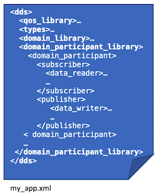

.. py:currentmodule:: rticonnextdds_connector

Defining a DDS system in XML
============================

*Connector* loads the definition of a DDS system from an XML configuration file
that includes the definition of domains, *DomainParticipants*, *Topics*, 
*DataReaders* and *DataWriters*, data types and quality of service.

*Connector* uses the XML schema defined by RTI's
`XML-Based Application Creation feature 
<https://community.rti.com/static/documentation/connext-dds/current/doc/manuals/connext_dds/xml_application_creation/html_files/RTI_ConnextDDS_CoreLibraries_XML_AppCreation_GettingStarted/index.htm>`__.

.. hint::
    The *Connext DDS* C, C++, Java and .NET APIs can also load the same XML files
    you write for *Connector*.

The following table summarizes the XML tags, the DDS concepts they define, and
how they are exposed in the *Connector* API:

.. list-table:: XML Configuration Tags
   :header-rows: 1

   * - XML Tag
     - DDS Concept
     - Connector API
   * - ``<types>``
     - *DDS data types* (the types associated with *Topics*)
     - Types used by inputs and outputs (:class:`Input` and :class:`Output`). 
   * - ``<domain_library>``, ``<domain>``, ``<register_type>`` and ``<topic>``
     - *DDS Domain*, *Topic*
     - Defines the domain joined by a :class:`Connector` and the *Topics* used by
       its inputs and outputs (:class:`Input` and :class:`Output`). 
   * - ``<domain_participant_library>`` and ``<domain_participant>``
     - *DomainParticipant*
     - Each :class:`Connector` instance loads a ``<domain_participant>``. See :ref:`Loading a Connector`.
   * - ``<publisher>`` and ``<data_writer>``
     - *Publisher* and *DataWriter*
     - Each ``<data_writer>`` defines an :class:`Output`. See :ref:`Writing Data (Output)`.
   * - ``<subscriber>`` and ``<data_reader>``
     - *Subscriber* and *DataReader*
     - Each ``<data_reader>`` defines an :class:`Input`. See :ref:`Reading Data (Input)`.
   * - ``<qos_library>`` and ``<qos_profile>``
     - Quality of service (QoS)
     - Quality of service used to configure :class:`Connector`, :class:`Input`
       and :class:`Output`.

.. hint::

  For an example configuration file, see `ShapeExample.xml 
  <https://github.com/rticommunity/rticonnextdds-connector-py/blob/master/examples/python/ShapeExample.xml>`__.

Data types
~~~~~~~~~~

The ``<types>`` tags define the data types associated with the *Topics* to be published
or subscribed to.

The following example defines a *ShapeType* with four members: ``color``, ``x``, ``y`` 
and ``shapesize``:

.. code-block:: xml

      <types>
        <struct name="ShapeType">
            <member name="color" type="string" stringMaxLength="128" key="true"/>
            <member name="x" type="int32"/>
            <member name="y" type="int32"/>
            <member name="shapesize" type="int32"/>
        </struct>
    </types>

Types are associated with *Topics*, as explained in the next section, :ref:`Domain Library`.

.. hint::
    You can define your types in IDL and convert them to XML with `rtiddsgen <https://community.rti.com/static/documentation/connext-dds/current/doc/manuals/connext_dds/code_generator/html_files/RTI_CodeGenerator_UsersManual/index.htm#code_generator/UsersManual/UsersManual_Title.htm>`__.
    For example: ``rtiddsgen -convertToXml MyTypes.idl``

For more information about defining types, see
`Creating User Data Types with XML <https://community.rti.com/static/documentation/connext-dds/current/doc/manuals/connext_dds/html_files/RTI_ConnextDDS_CoreLibraries_UsersManual/index.htm#UsersManual/Creating_User_Data_Types_with_Extensible.htm>`__
in the *RTI Connext DDS Core Libraries User's Manual*.

For more information about accessing data samples, see :ref:`Accessing the data`.

Domain library
~~~~~~~~~~~~~~

A domain library is a collection of domains. A domain specifies:

  * A `domain id <https://community.rti.com/static/documentation/connext-dds/current/doc/manuals/connext_dds/html_files/RTI_ConnextDDS_CoreLibraries_UsersManual/index.htm#UsersManual/ChoosingDomainID.htm>`__.
  * A set of registered types (from a subset of the types in ``<types>``).
    A registered type can have a local name.
  * A set of `topics <https://community.rti.com/static/documentation/connext-dds/current/doc/manuals/connext_dds/html_files/RTI_ConnextDDS_CoreLibraries_UsersManual/index.htm>`__,
    which are used by *DataReaders* and *DataWriters*.

.. code-block:: xml

    <domain_library name="MyDomainLibrary">
        <domain name="MyDomain" domain_id="0">
            <register_type name="ShapeType" type_ref="ShapeType"/>
            <topic name="Square" register_type_ref="ShapeType"/>
            <topic name="Circle" register_type_ref="ShapeType"/>
        </domain>
    </domain_library>

For more information about the format of a domain library, see
`XML-Based Application Creation: Domain Library <https://community.rti.com/static/documentation/connext-dds/current/doc/manuals/connext_dds/xml_application_creation/html_files/RTI_ConnextDDS_CoreLibraries_XML_AppCreation_GettingStarted/index.htm#XMLBasedAppCreation/UnderstandingPrototyper/DomainLibrary.htm>`__.

Participant library
~~~~~~~~~~~~~~~~~~~

A *DomainParticipant* joins a domain and contains *Publishers* and *Subscribers*,
which contain *DataWriters* and *DataReaders*, respectively.

Each :class:`Connector` instance created by your application is associated with a
``<domain_participant>``, as explained in :ref:`Loading a Connector`.

*DataReaders* and *DataWriters* are associated with a *DomainParticipant* and a 
*Topic*. In *Connector*, each ``<data_writer>`` tag defines an :class:`Output`, 
as described in :ref:`Writing data (Output)`; and each ``<data_reader>`` tag defines 
an :class:`Input`, as described in :ref:`Reading data (Input)`.

.. code-block:: xml

    <domain_participant_library name="MyParticipantLibrary">
        <domain_participant name="MyPubParticipant" domain_ref="MyDomainLibrary::MyDomain">
            <publisher name="MyPublisher">
                <data_writer name="MySquareWriter" topic_ref="Square" />
            </publisher>
        </domain_participant>

        <domain_participant name="MySubParticipant" domain_ref="MyDomainLibrary::MyDomain">
            <subscriber name="MySubscriber">
                <data_reader name="MySquareReader" topic_ref="Square" />
            </subscriber>
        </domain_participant>
    </domain_participant_library>

For more information about the format of a participant library, see the 
`XML-Based Application Creation Getting Started Guide   
<https://community.rti.com/static/documentation/connext-dds/current/doc/manuals/connext_dds/xml_application_creation/html_files/RTI_ConnextDDS_CoreLibraries_XML_AppCreation_GettingStarted/index.htm#XMLBasedAppCreation/UnderstandingPrototyper/ParticipantLibrary.htm>`__.

Quality of service
~~~~~~~~~~~~~~~~~~

All DDS entities have an associated `quality of service (QoS) <https://community.rti.com/static/documentation/connext-dds/current/doc/manuals/connext_dds/html_files/RTI_ConnextDDS_CoreLibraries_UsersManual/index.htm#UsersManual/QosPolicies.htm>`__.
There are several ways to configure it.

You can define a QoS profile and make it the default. The following example
configures all *DataReaders* and *DataWriters* with reliable and transient-local QoS:

.. code-block:: xml

    <qos_library name="MyQosLibrary">
        <qos_profile name="MyQosProfile" is_default_qos="true">
            <datareader_qos>
                <reliability>
                    <kind>RELIABLE_RELIABILITY_QOS</kind>
                </reliability>
                <durability>
                    <kind>TRANSIENT_LOCAL_DURABILITY_QOS</kind>
                </durability>
            </datareader_qos>
            <datawriter_qos>
                <reliability>
                    <kind>RELIABLE_RELIABILITY_QOS</kind>
                </reliability>
                <durability>
                    <kind>TRANSIENT_LOCAL_DURABILITY_QOS</kind>
                </durability>
            </datawriter_qos>
        </qos_profile>
    </qos_library>

You can define the QoS for each individual entity:

.. code-block:: xml

    <domain_participant name="MyPubParticipant" domain_ref="MyDomainLibrary::MyDomain">
        <participant_qos> <!-- ... --> </participant_qos>
        <publisher name="MyPublisher">
            <publisher_qos> <!-- ... --> </publisher_qos>
            <data_writer name="MySquareWriter" topic_ref="Square">
                <datawriter_qos>
                    <reliability>
                        <kind>RELIABLE_RELIABILITY_QOS</kind>
                    </reliability>
                    <durability>
                        <kind>TRANSIENT_LOCAL_DURABILITY_QOS</kind>
                    </durability>
                </datawriter_qos>
            </data_writer>
        </publisher>
    </domain_participant>

Or you can use profiles and override or define additional QoS policies for each
entity:

.. code-block:: xml

    <domain_participant name="MyPubParticipant" domain_ref="MyDomainLibrary::MyDomain">
        <participant_qos base_name="MyQosLibrary::MyQosProfile">
            <!-- override or configure additional QoS policies -->
        </participant_qos>
        <publisher name="MyPublisher">
            <publisher_qos base_name="MyQosLibrary::MyQosProfile">
                <!-- override or configure additional QoS policies -->
            </publisher_qos>
            <data_writer name="MySquareWriter" topic_ref="Square">
                <datawriter_qos base_name="MyQosLibrary::MyQosProfile">
                    <!-- override or configure additional QoS policies -->
                </datawriter_qos>
            </data_writer>
        </publisher>
    </domain_participant>

You can also use builtin profiles and QoS snippets. For example, the following
profile is equivalent to *MyQosProfile* above:

.. code-block:: xml

    <qos_library name="MyQosLibrary">
        <qos_profile name="MyQosProfile" is_default_qos="true">
            <base_name>
                <element>BuiltinQosSnippetLib::QosPolicy.Durability.TransientLocal</element>
                <element>BuiltinQosSnippetLib::QosPolicy.Reliability.Reliable</element>
            </base_name>
        </qos_profile>
    </qos_library>

You can read more in the *RTI Connext DDS Core Libraries User's Manual*, 
`Configuring QoS with XML 
<https://community.rti.com/static/documentation/connext-dds/current/doc/manuals/connext_dds/html_files/RTI_ConnextDDS_CoreLibraries_UsersManual/index.htm#UsersManual/XMLConfiguration.htm>`__.