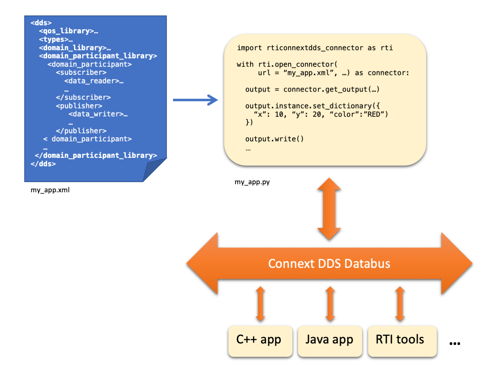

.. py:currentmodule:: rticonnextdds_connector

Introduction to RTI Connector
=============================

*RTI Connext DDS* is a software connectivity framework for real-time distributed
applications. It uses the publish-subscribe communications model to make
data distribution efficient and robust. At its core is the world's
leading ultra-high performance, distributed networking databus.

*RTI Connector* is a family of simplified APIs for publishing and subscribing
to the *Connext DDS* Databus in programming languages such as Python and JavaScript. 
(RTI also offers a more comprehensive `Python API <https://community.rti.com/static/documentation/connext-dds/current/api/connext_dds/api_python/intro.html>`__, 
which is experimental.)

.. note::

    This documentation assumes you are already familiar with basic DDS 
    concepts. You can learn about DDS in the *RTI Connext DDS 
    Getting Started Guide*, *RTI Connext DDS Core Libraries User's Manual*, 
    and the *Connext DDS* API documentation for C,
    C++, Java and .NET. These documents are available from the
    `RTI Community portal <https://community.rti.com/documentation>`__.

In *Connector*, the DDS system is defined in XML. This includes the DDS entities
and their data types and quality of service. Applications instantiate a
:class:`Connector` object that loads an XML configuration and creates the entities
that allow publishing and subscribing to DDS Topics.

By publishing and subscribing to DDS Topics, *Connector* works seamlessly 
with any other *DDS* applications, including *Connext DDS* user applications, and
RTI Tools and Infrastructure Services.

How to read this documentation
~~~~~~~~~~~~~~~~~~~~~~~~~~~~~~

  * First learn how to install *Connector* and run the examples in :ref:`Getting Started`.

  * Learn how to define the DDS system in XML in :ref:`Defining a DDS system in XML`.

  * Learn how to write a *Connector* application in
    :ref:`Loading a Connector`, :ref:`Writing Data (Output)`, and :ref:`Reading Data (Input)`.
    These sections include examples and detailed type and function documentation.

  * See :ref:`Advanced Topics` for details on the different ways to
    access the data, the threading model, and error reporting. If you want to
    know whether a *Connext DDS* feature is supported in *Connector*,
    and how to use it, see :ref:`Connext DDS Features`.

If you're looking for a specific class or function, go directly to the :ref:`genindex`.
